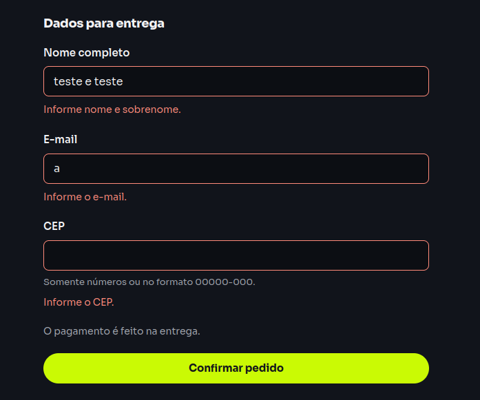

# Sugestão de melhoria — feedback de validação no checkout

**Classificação:** sugestão de usabilidade; não registrada como defeito confirmado.

## Observação

A mensagem de erro do campo continua visível enquanto o usuário digita para corrigir o valor. A captura mostra a tela “Dados para entrega” com o nome `teste e teste`, o e-mail `a` e o CEP vazio, junto das mensagens de validação.

O valor do nome aparenta conter nome e sobrenome, mas a captura isolada não registra os passos anteriores nem quando a validação é atualizada. O e-mail `a` e o CEP vazio continuam inválidos, então as mensagens desses campos são compatíveis com os valores mostrados e não comprovam, por si só, que o erro ficou desatualizado.

## Sugestão

Após o usuário corrigir um campo para um valor válido, atualizar o estado visual e a mensagem de validação em um momento consistente — por exemplo, ao sair do campo ou ao tentar enviar novamente. Assim, o formulário não mantém indicação de erro para um valor que já foi corrigido. O atributo `aria-invalid` também deve acompanhar o estado atual.

## Como confirmar durante a exploração

1. Envie o formulário vazio para exibir os erros.
2. Corrija somente o nome para `Maria Silva` e observe a mensagem enquanto digita e depois de sair do campo.
3. Repita com um e-mail válido e com o CEP `01310-100`.
4. Registre em que momento cada mensagem e indicação visual são removidas, e se isso ocorre antes de um novo envio.

**Resultado:** pendente de confirmação desses passos. A imagem foi preservada como indício visual do estado relatado.

## Evidência

